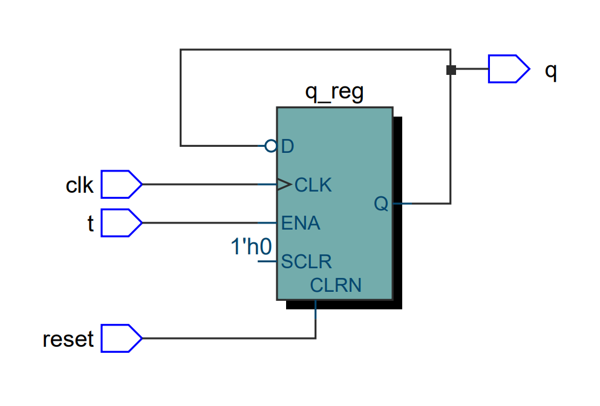
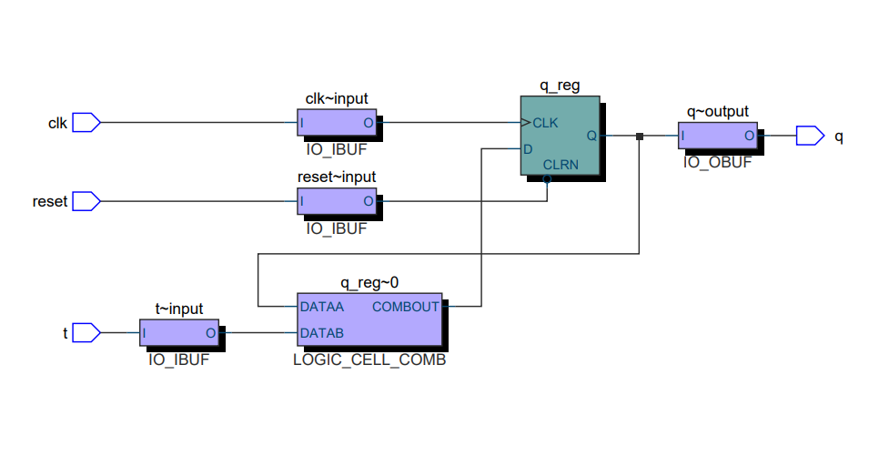

# T-flip-flop-using-VHDL
This is a VHDL implementation of T flip flop on quartus prime software

## How doea a T Flip Flop works 

A T flip-flop, also known as a toggle flip-flop, is a fundamental digital electronic circuit component. It operates as a binary state memory element, capable of storing either a 0 or a 1. Unlike other flip-flops that respond to specific clock transitions or input conditions, a T flip-flop toggles its output state (changes from 0 to 1 or vice versa) whenever its "toggle" or "T" input is triggered. In essence, if the T input is 1, the output switches to its opposite state on the clock transition; if the T input is 0, the output remains unchanged. This toggle behavior makes T flip-flops useful for various applications, including counters, frequency dividers, and state machines.
  
The following picture is the RTL representation of the T flip flop

   
The following image shows the technology map representation of the T flip flop

Tewodros Seble
All Rights Reserved
